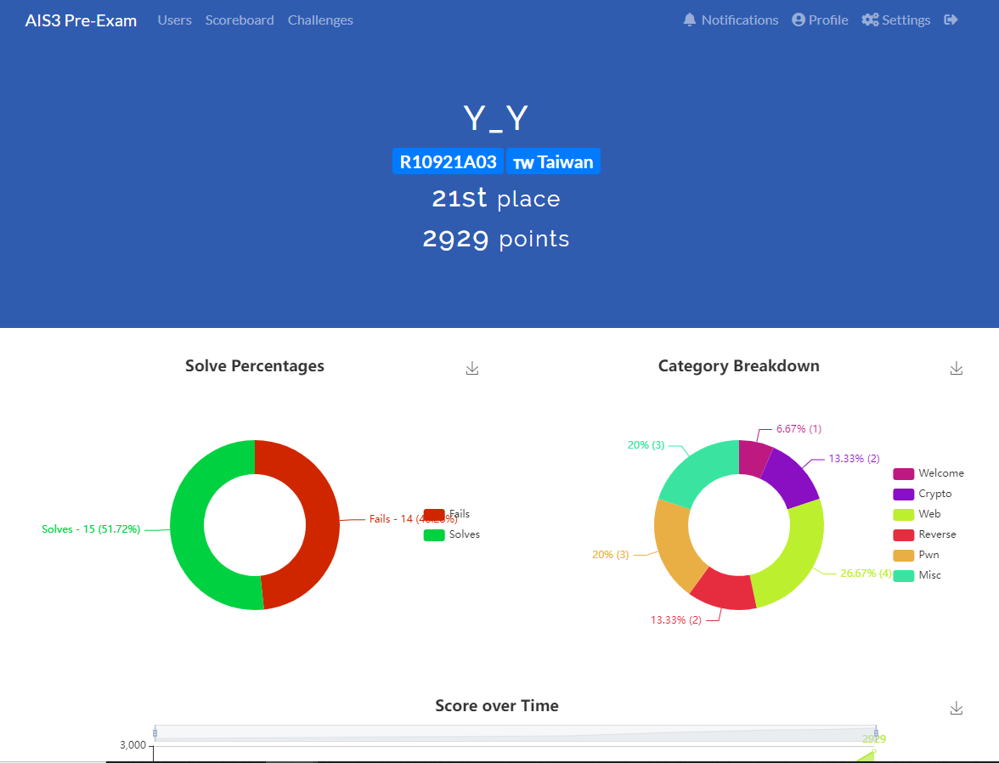

# 2022-AIS3-PreExam-CTF-Writeups
## Introduction
- [AIS3](https://ais3.org/)

    AIS3 (Advanced Information Security Summer School) 新型態資安暑期課程是由教育部資訊安全人才培育計畫推動辦公室所主辦。 從2015 年暑假開始，第一年在臺灣科技大學舉辦，學員人數100 人。(從官網複製過來)
    
## Rank

- Rank: 21 / 292
- Solved Problem:
    - Crypto
        - [SC](./crypto/SC)
        - [Fast Cipher](./crypto/fast-cipher)
    - Web
        - [Poking Bear (First Blood :heart_eyes: )](./web/Poking-bear)
        - [Simple file uploader](./web/Simple-file-uploader)
        - [The Best Login UI](./web/The-best-login-ui)
        - [Cat Emoji Database](./web/Cat-Emoji-Database)
    - Reverse
        - [Time Management](./revrse/time-management)
        - [Calculator](./revrse/caculator)
    - Pwn
        - SAAS-Crash
        - [Bof2win](./pwn/pwnbox/bof2win)
        - [Give Me SC](./pwn/pwnbox/give-me-sc)

## Review
這是我人生中參加的第二個CTF *(第一個是AIS3 EOF 2021)*

因為這學期在台大修了 `網路攻防實習` 課程，而這門課規定期末成績要用此CTF的分數去算，佔總成績的18%，所以藉此機會來參加此比賽。

幸好上學期有先經過 `計算機安全` 課程的洗禮，因此在解題時比較沒那麼陌生。

### 解題過程
一開始先看比較熟悉的Web題目，也順利拿到水題`Poking Bear`的首殺。後來遇到解Web遇到瓶頸時也會去試著解其他類別的 Easy 題目。

這次CTF很幸運地解了蠻多題，感覺難度真的比較適合剛接觸的新手，而且題目都蠻有趣的。這場比賽中第一次下載dnSpy解.NET的reverse。第三天早上起來靈感湧現，一次就解了三題出來。

最後很可惜的是把Web題目`TariTari`解到可以有條件RCE了，但還是來不及產出FLAG。還有在賽後重新看了一遍ASTJail的source code跟doc後就找到漏洞了，後來也順利拿到FLAG。
